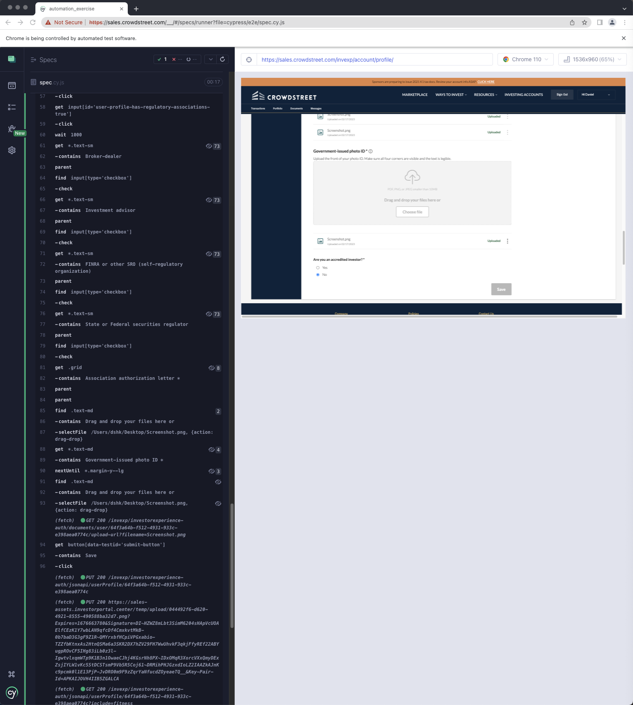
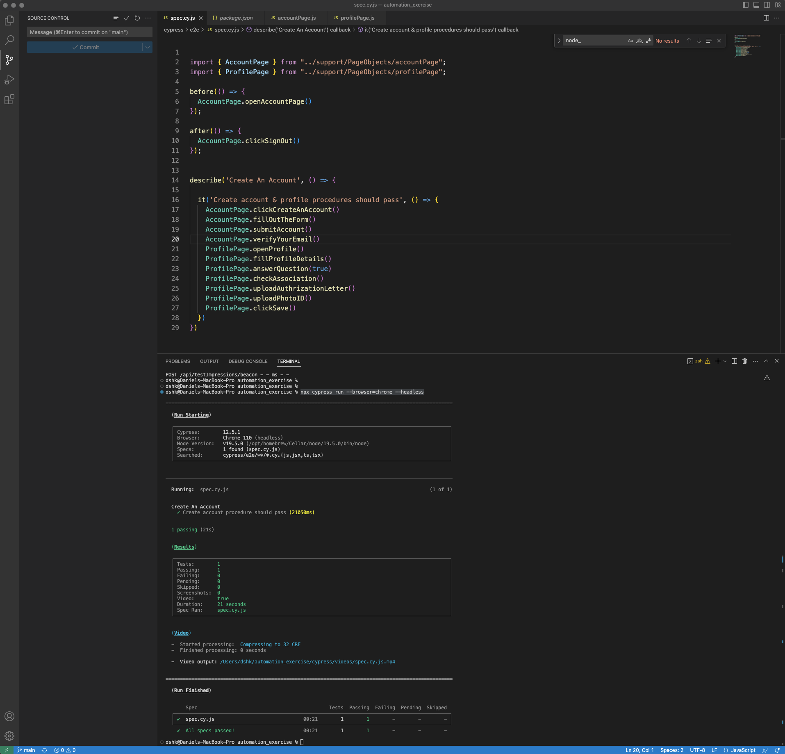

# Automation Exercise

The exercise is utilizing Cypress framework and automating account steps for [sales.crowdstreet.com](https://sales.crowdstreet.com/) web site.

The UI tests are designed to run on multiple browsers, the default browsers being Chrome and Firefox.

The project has been built and tested using the following resources:

* macOS Venture 13.0.1
* Visual Studio Code 1.75.1 (Universal)
* Nodejs v19.5.0
* NPM 9.5.0
* Chrome 110.0.5481.100 (Official Build) (arm64)
* Cypress 12.5.1

# Automated steps

* Starting at [sales.crowdstreet.com](https://sales.crowdstreet.com/), click the ‘Create an Account’ button in the top-right of the application
* Fill out the form and successfully create an account
* When the modal appears to verify your email or skip, choose to “Skip, I’ll do later”
* Navigate to the Profile and Settings via the dropdown under your account button in the top-right of the application
* You will see menu tabs on the left of the page that loads in, defaulting to “Profile”
* Fill out all of the required information on this page, and save it.
* Be sure to upload a Government Issued Photo ID in the appropriate section
* You can mark the question “Are you, your spouse, or any other dependents employed by, or associated with, a broker-dealer firm or a financial services regulatory agency?” as “No” for now. 
For bonus points, answer it Yes, and see if you can overcome the requirement issues for the following fields.

## Requirements

Follow the instructions below to resolve dependencies:

```shell
# Install Cypress latest version
npm i cypress --save-dev
```
Set required Cypress environment variables.

All variables should be stored in cypress.env.json

Follow [cypress.io](https://docs.cypress.io/guides/guides/environment-variables) web site to create JSON configuration file.

Add the next environment variables with your parameters to the configuration file:

```json
{
    "FIRST_NAME": "first name",
    "LAST_NAME": "last name",
    "EMAIL_ADDRESS": "email address",
    "PASSWORD": "password",
    "SSN": "ssn",
    "RESIDENCE_STATUS": "I'm a U.S. resident",
    "COUNTRY_OF_CITIZENSHIP": "country of citizenship",
    "MARITAL_STATUS": "marital status",
    "DATE_OF_BIRTH": "date of birth",
    "ADDRESS": "address",
    "CITY": "city",
    "ZIP_CODE": "zip code",
    "STATE": "state",
    "COUNTRY": "country",
    "PHOTO_ID_PATH": "path to photo id",
    "AUTHORIZATION_LETTER": "path to authorization letter"
}
```

## Usage

This is intended as a quick reference for starting a test environment:

```shell
# Open Cypress runner user interface
# Select E2E testing option
# Choose browser and click Start E2E Testing
# Click cypress/e2e/spec.cy.js file to start automation
npx cypress open

# Run Cypress in command line with headless mode
npx cypress run --browser=chrome --headless
```

## Screenshots




